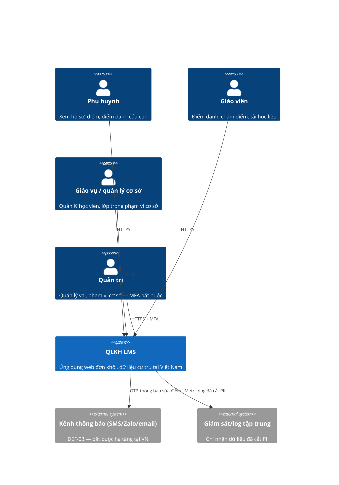
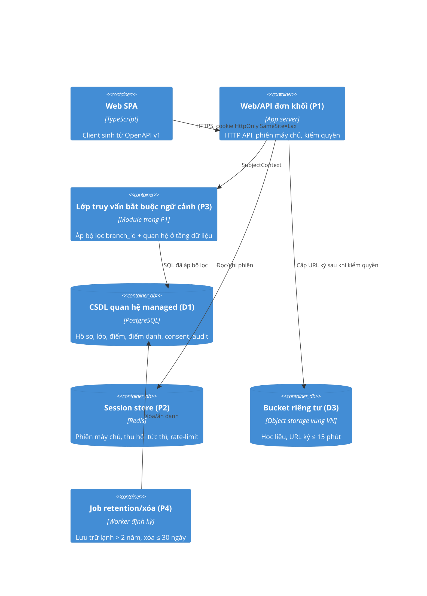

# Kiến trúc QLKH — C4 L1–L2

Nguồn: approved-specs QLKH (PRD v0.2), prd v16 (ADR-001..006), threat-model v1.0.
Phạm vi: LMS single-tenant, 3 cơ sở TP.HCM, 1.200 học viên, ~1.000 tài khoản phụ huynh, cao điểm 60 giáo viên điểm danh đồng thời 17h30–18h00.

## L1 — Context

## L2 — Container

## Ranh giới tin cậy
- TB-1 Internet → biên: mọi dữ liệu từ client là không tin cậy, kể cả `branch_id`.
- TB-2 biên → nội bộ.
- TB-3 ứng dụng → dữ liệu: **bắt buộc đi qua P3**. Không có ranh giới tenant (ADR-001).
- TB-4 hệ thống → bên thứ ba: chỉ nhà cung cấp có hạ tầng tại VN (ADR-006, T-13).

## Bounded context và chủ sở hữu dữ liệu
| Context | Sở hữu bảng | Đọc từ context khác qua |
|---|---|---|
| Identity & Access | users, roles, user_branch_scope, sessions | API nội bộ |
| People | students, parents, parent_student, teachers | API nội bộ |
| Teaching | classes, enrollments, attendance, grades, grade_history | API nội bộ |
| Content | materials | API nội bộ |
| Compliance | consents, erasure_requests, audit_log | API nội bộ |

Không context nào truy vấn thẳng bảng của context khác.

## Ánh xạ NFR → quyết định kiến trúc
| NFR | Cấu trúc thỏa mãn |
|---|---|
| NFR-001 uỷ quyền | P3 + cổng CI chặn endpoint PII thiếu test uỷ quyền (ADR-004) |
| NFR-002 xác thực | Phiên máy chủ + argon2id + khóa tạm (ADR-002) |
| NFR-003 vận hành | Monolith + DB managed (ADR-003) |
| NFR-004/005 hiệu năng, sẵn sàng | Phân trang bắt buộc, timeout truy vấn 5s, rate-limit 120/phút/tài khoản và 600/phút/IP, báo cáo bất đồng bộ |
| NFR-006/007 tuân thủ ND13 | Residency VN, log cắt PII, retention 2 năm, xóa ≤ 30 ngày (ADR-006) |

## Xử lý khi phụ thuộc hỏng
| Phụ thuộc | Timeout | Retry | Khi hỏng |
|---|---|---|---|
| DB | 5s | không retry ghi | 503 + alert |
| Session store | 1s | 1 lần | từ chối đăng nhập mới, phiên hiện có suy giảm |
| Bucket | 3s | 2 lần backoff | tải học liệu lỗi, phần còn lại vẫn chạy |
| Kênh thông báo | 3s | 3 lần backoff + hàng đợi | xếp hàng gửi lại, không chặn luồng chính |

## Fitness function trong CI
1. `domain` không import ORM/HTTP/framework.
2. Không vòng phụ thuộc giữa module.
3. Mọi truy cập bảng PII đi qua P3 (kiểm call graph).
4. Ngân sách p95 endpoint điểm danh dưới ngưỡng NFR-004 trong kịch bản 60 phiên đồng thời.
5. Quét IaC chặn `public-read`.

## Đường găng
QLKH-001 → 002 → 003 → 004 → 005 → 006 → 007 → 008 → 009. QLKH-010/011/013 chạy song song sau nút phụ thuộc tương ứng.

## Điều kiện chặn Gate 3
DEF-01/02/03 quyết xong, DPIA hoàn thành, mọi threat High mitigated (threat-model mục 7).
